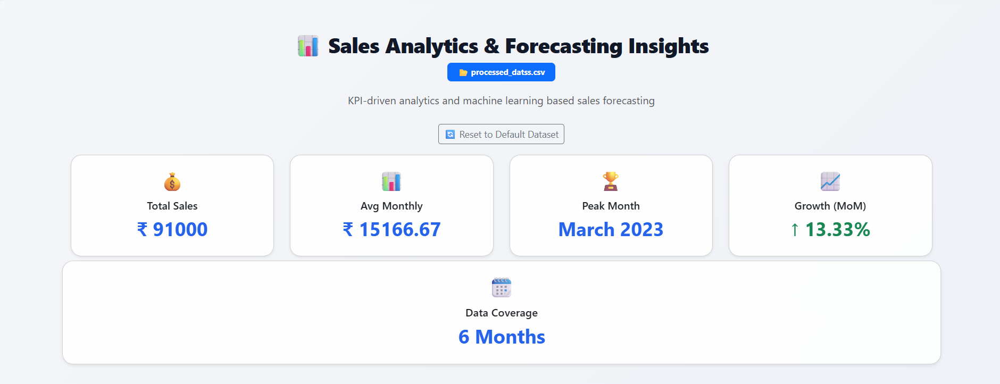
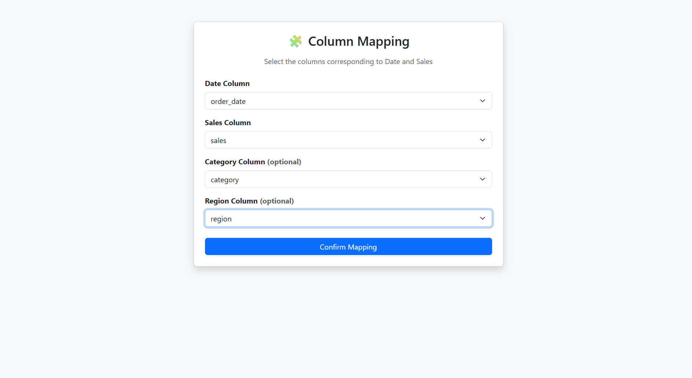
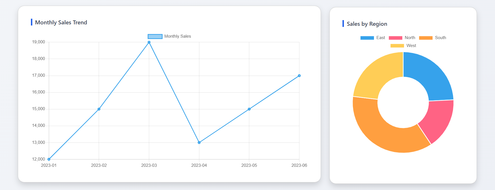
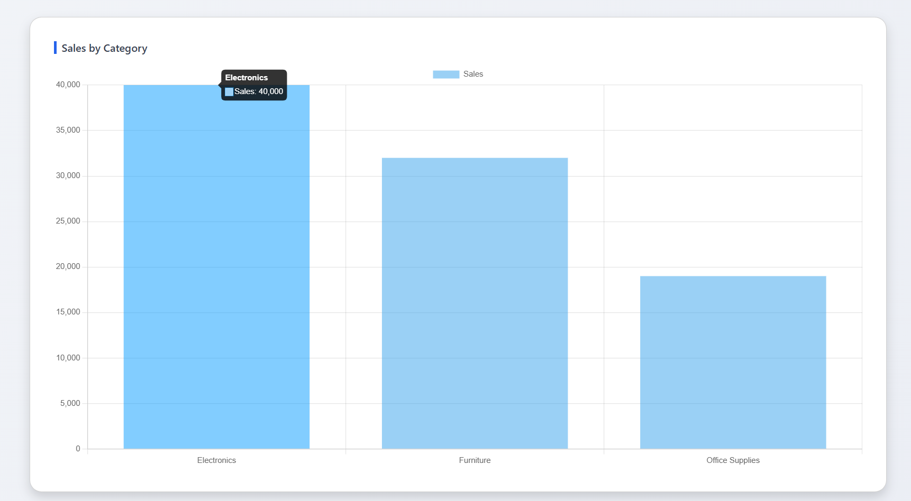
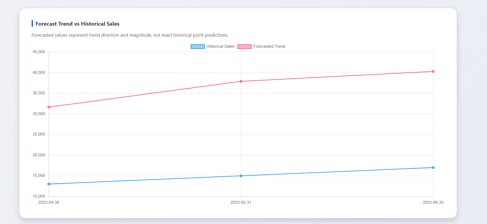

## 📊 Smart Sales Analytics & Forecasting System

[](https://smart-sales-analytics-forecasting.onrender.com)


## 📸 Screenshots

### Index Page


### Column Mapping


### Dashboard


### Monthly Sales Trend and Sales By Region


### Sales By Category


### Forecast Trend VS Historical Sales



🧠 Overview

Smart Sales Analytics & Forecasting System is a full-stack, machine learning–powered web application built using Flask, Pandas, and Chart.js.

It enables users to:

• Analyze historical sales data using KPIs and interactive dashboards

• Upload and analyze any sales dataset using column mapping

• Forecast future sales using machine learning time-series models

• Visualize trends, categories, regions, and model behavior

This project follows industry-standard data science and ML workflows:

1. Data preprocessing & feature engineering

2. Time-series lag feature creation

3. Model experimentation & evaluation

4. Recursive forecasting logic

5. Modular backend APIs

6. Production-style frontend dashboards

🎯 Project Objective

To build a production-ready sales analytics platform that combines:

• Business KPIs

• Exploratory data analysis

• Machine learning forecasting

• Dataset flexibility (upload + column mapping)

• Clean UI/UX for real-world analytics use cases

🚀 Key Features: 

📊 Analytics Dashboard

✅ KPI-driven dashboard
✅ Total Sales
✅ Average Monthly Sales
✅ Peak Sales Month
✅ Month-over-Month Growth
✅ Dataset coverage (months)

📈 Interactive Visualizations:

📊 Monthly Sales Trend
🧩 Category-wise Sales
🌍 Region-wise Sales
📉 Actual vs Predicted Sales Comparison

🤖 Machine Learning Forecasting:

🔁 Recursive time-series forecasting
📆 Adjustable forecast horizon (3 / 6 / 12 months)
🧠 Lag-based feature engineering
📈 Trend-focused predictions

📂 Dataset Upload & Mapping :

📤 Upload any CSV sales dataset
🧭 Column mapping for:

• Order Date

• Sales

• Category (optional)

• Region (optional)

📌 Automatic standardization of uploaded data
📌 Dashboard updates dynamically for new datasets

🎨 UI / UX :

✨ Clean enterprise-style dashboard
✨ Animated KPI cards
✨ Loading spinners
✨ Dataset badge indicator
✨ Responsive layout
✨ Portfolio-ready landing page with GitHub & LinkedIn links

🤖 Machine Learning Model Used :

The forecasting model is trained using:

• Linear Regression (baseline time-series model)

• Lag features:

1. lag_1

2. lag_3

3. rolling_3_mean

• Temporal features:

1. Month

2. Year

📌 Recursive forecasting is used to predict future values step-by-step.

Note: Random Forest was evaluated but performed worse for this dataset, highlighting proper model selection based on time-series behavior.

🧠 Forecasting Strategy

Time-series forecasting requires recursive prediction, meaning:

• Each predicted value is fed back as input

• Lag features update dynamically

• Model focuses on trend and magnitude, not exact point replication

This mirrors real-world sales forecasting systems.

📂 Dataset Support: 

✅ Default Dataset

• Preloaded sales dataset for demo and evaluation

✅ Custom Dataset Upload

Users can upload any CSV file, provided it contains:

• A date column

• A numeric sales column

Optional:

• Category column

• Region column

📌 Column names do not need to match predefined names — mapping is handled via UI.

📦 Installation: 

1️⃣ Create a Virtual Environment (using conda)
```bash
conda create -n sales311 python=3.11
```
Activate the virtual environment:
```bash
conda activate sales311
```
2️⃣ Install Dependencies
```bash
pip install -r requirements.txt
```
💻 Usage
Run the Flask Application
```bash
python run.py
```

What You Can Do

• Upload your own dataset

• Map columns dynamically

• View KPIs and analytics

• Forecast future sales

• Reset to default dataset anytime

🧪 Educational Disclaimer

⚠️ This project is built for learning, demonstration, and portfolio purposes only.
It should not be used directly for business-critical financial decisions without further validation.

📫 Contact

📧 Email: kadithyaom@gmail.com

🔗 GitHub: https://github.com/adithyaom18

🔗 LinkedIn: https://www.linkedin.com/in/k-adithya-om

🌐 Live Demo

🔗 https://smart-sales-analytics-forecasting.onrender.com
